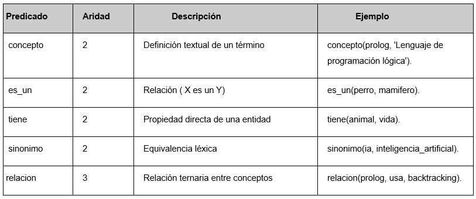
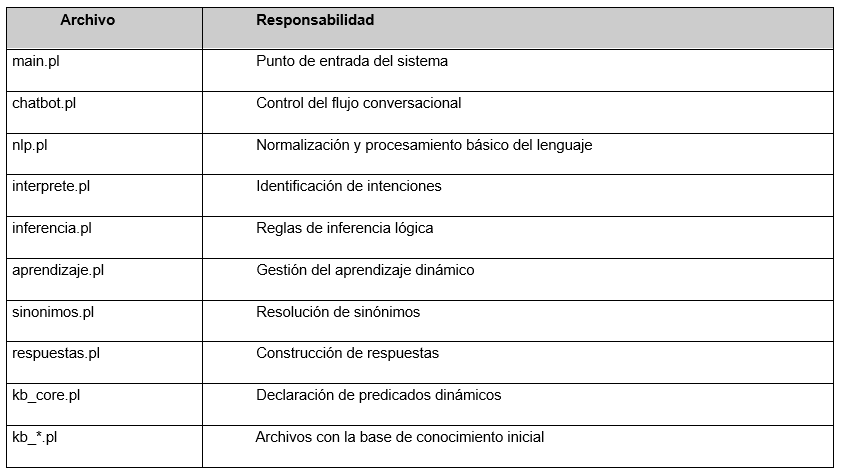

# Proyecto #3: Paradigma lógico

## Chatbot Inteligente con Prolog

**Lenguajes de Programación GR 2**

**Autores:**

Fabián Alejandro Sánchez Durán

Santiago Villarreal Arley

Randy Baeza Ramírez

## Enlace de GitHub

El siguiente enlace
([https://github.com/Villarley/prolog-lenguajes](https://github.com/Villarley/prolog-lenguajes))
es el repositorio de GitHub utilizado para la realización del proyecto.
Todos los estudiantes fuimos contribuidores en el proyecto y lo hicimos
en el branch main. Algunos trabajamos en branches separadas, y luego
hicimos un merge usando Pull Requests.

##   Pasos de Instalación

1.  Instalar SWI-Prolog 8.x o superior.
    [https://www.swi-prolog.org/](https://www.swi-prolog.org/)

2.  Abrir la terminal y navegar a la raíz del proyecto

3.  Ejecutar: 
    ``` bash
    swipl src/main.pl
    ```


Para iniciar solo el bucle conversacional desde el REPL (después de
cargar):
``` bash
> ?- \[src/main\].
> ?- iniciar.
```

## Manual de Usuario

Al iniciar el programa (siguiendo las reglas de instalación) se presenta
el siguiente menú:


De aquí, se pueden realizar preguntas, aclaraciones y todo
lo que se puede realizar con el bot. Por ejemplo, se puede iniciar
haciendo una pregunta.


A continuación, se muestra el caso de que el bot no sepa la respuesta a
una pregunta puede aprender:


Entonces, si le consulto lo mismo luego de explicar qué fue mi pregunta,
la respuesta será diferente:


Es importante notar que hay variaciones de preguntas que se pueden realizar sin problema (como qué es, defina, explique,
defina, etc):


Además, el bot puede aprender sobre sinónimos que el
usuario le diga y puedan ser importantes para futuros chats.

Por ejemplo, para este caso le expliqué que auto y carro eran sinónimos, le dije que era un auto pero luego le consulté que era un carro:


Además, el bot puede aprender relaciones entre cosas en su knowledge base:


Finalmente, al dejar de hablar con el bot, se escribe la palabra `salir`:


## Arquitectura lógica utilizada

El chatbot fue desarrollado siguiendo una arquitectura declarativa basada en los principios de la programación lógica en Prolog. La solución se encuentra organizada en múltiples archivos, cada uno con una
responsabilidad específica dentro del proceso de conversación, inferencia y aprendizaje.

La arquitectura está compuesta por cuatro etapas principales:

1.  **Procesamiento de entrada (NLP)**

    - Recibe el texto ingresado por el usuario.

    - Normaliza la entrada convirtiendo las palabras a minúsculas,
      eliminando tildes, signos de puntuación y palabras irrelevantes.

    - Genera una lista de tokens que será utilizada por las siguientes
      etapas.

2.  **Interpretación de intenciones**

    - Analiza los tokens obtenidos.

    - Identifica la intención del usuario mediante coincidencia de
      patrones.

    - Determina si se trata de una consulta, una solicitud de
      definición, una acción de aprendizaje, una consulta de relaciones
      o una orden para finalizar la conversación.

3.  **Procesamiento lógico**

    - Ejecuta las reglas de inferencia y aprendizaje.

    - Consulta la base de conocimiento.

    - Aplica herencia de propiedades, relaciones entre conceptos y
      manejo de sinónimos.

    - Permite agregar nuevo conocimiento dinámicamente mediante
      predicados dinámicos.

4.  **Generación de respuestas**

    - Construye la respuesta correspondiente.

    - Presenta los resultados al usuario mediante mensajes en consola.

El flujo general puede representarse de la siguiente manera:


## Organización del conocimiento

La base de conocimiento utiliza cinco predicados principales, los cuáles
son declarados como dinámicos, permitiendo agregar conocimiento durante
la ejecución.



## Organización de archivos

El sistema fue dividido en módulos lógicos para facilitar el
mantenimiento y la separación de responsabilidades:



## Explicación del funcionamiento

Al iniciar el programa, el archivo `main.pl` carga todos los componentes del sistema y la base de conocimiento inicial. Posteriormente se activa el ciclo conversacional implementado en `chatbot.pl.`

El chatbot funciona mediante una conversación recursiva. En cada iteración se realizan los siguientes pasos:

**1. Recepción de la consulta**

El usuario introduce una frase en consola.

Ejemplo: ¿Qué es Prolog?

**2. Procesamiento del lenguaje**

El módulo `nlp.pl` normaliza la entrada: convierte a minúsculas, elimina
signos de puntuación y tildes, parte el texto en átomos, descarta
palabras conectoras como "el", "la". Finalmente, crea una lista de
tokens.

**3. Identificación de la intención**

El módulo `interprete.pl` analiza los patrones de los tokens y determina
la intención de la consulta.

Por ejemplo: ¿Qué es Prolog?

Se transforma internamente en: `intencion(consultar, prolog)`

**4. Consulta de conocimiento**

El sistema busca información en la base de conocimiento.

Si existe un hecho como:

`concepto(prolog, \'Lenguaje de programación lógica\').`

El chatbot genera una respuesta utilizando el módulo `respuestas.pl.`

**5. Aplicación de inferencias**

Cuando la respuesta no se encuentra de forma directa, el sistema intenta
obtenerla mediante reglas de inferencia.

Ejemplo:
``` bash
es_un(perro, mamifero).

es_un(mamifero, animal).

tiene(animal, vida).

?- propiedad_de(perro, vida).

true.
```

**6. Manejo de sinónimos**

Antes de realizar consultas, los términos son convertidos a una forma canónica.

Ejemplo: `sinonimo(ave, pajaro).`

Por lo tanto: ¿Qué es ave? Y ¿Qué es pájaro? pueden producir resultados
equivalentes.

**7. Aprendizaje dinámico**

Si el chatbot no posee información suficiente para responder una
consulta, solicita una definición al usuario.

Ejemplo: ¿Qué es Ruby?

Respuesta:

``` bash
Bot\> No tengo informacion sobre eso todavia.

Bot\> Cuentame, que es ruby? (escribe una definicion)
```

Si el usuario proporciona una definición, el sistema la almacena utilizando:

`assertz(concepto(ruby, \'Lenguaje orientado a objetos\')).`

A partir de ese momento el conocimiento queda disponible para futuras
consultas.

**8. Continuación o finalización**

Una vez generada la respuesta, el chatbot vuelve a esperar una nueva entrada del usuario. Este proceso continúa de manera recursiva hasta que se detecta una intención de salida, como por ejemplo: `salir`

En ese momento se muestra un mensaje de despedida y finaliza la
ejecución.
