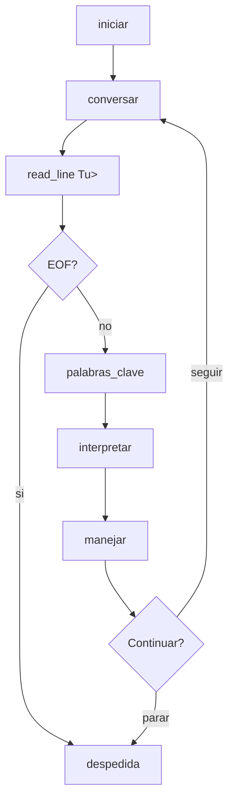
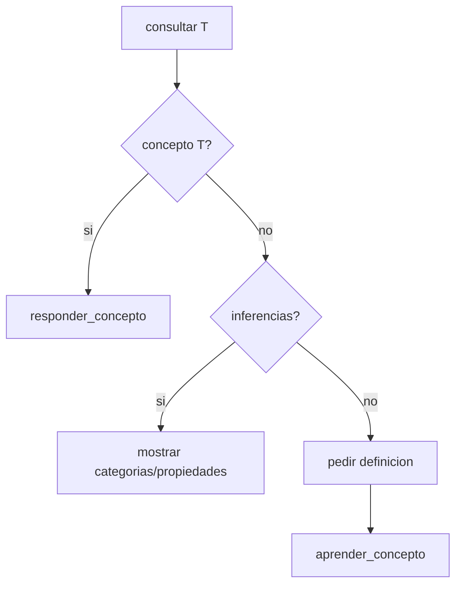

# Arquitectura lógica del chatbot

Documento de referencia para la sección **Arquitectura lógica utilizada** del informe de entrega.

## Visión general

El sistema sigue un pipeline declarativo en cuatro capas:

```
Entrada (string)
    → NLP (tokens)
    → Intérprete (intención)
    → Manejador conversacional
        → Respuestas / Inferencia / Aprendizaje
            → Base de conocimiento (hechos dinámicos)
```

No se usa el sistema de módulos de Prolog: todos los archivos se cargan con `consult/1` en el namespace `user`, de modo que `assertz` y `retract` sobre predicados `:- dynamic` compartidos funcionen sin fricción.

## Modelo de datos (5 predicados)

Declarados una sola vez en `kb/kb_core.pl`:

| Predicado | Aridad | Significado | Ejemplo |
|-----------|--------|-------------|---------|
| `concepto` | 2 | Definición textual | `concepto(prolog, 'Lenguaje lógico...')` |
| `es_un` | 2 | Taxonomía (herencia) | `es_un(perro, mamifero)` |
| `tiene` | 2 | Propiedad directa | `tiene(animal, vida)` |
| `sinonimo` | 2 | Equivalencia léxica | `sinonimo(pl, programacion_logica)` |
| `relacion` | 3 | Relación ternaria | `relacion(prolog, usa, backtracking)` |

Cada integrante aporta hechos en su archivo `kb_*.pl` con `:- multifile` (las declaraciones `:- dynamic` y `:- multifile` viven en `kb_core.pl`). Esto permite cargar varios archivos de hechos sin que SWI-Prolog convierta los predicados en estáticos.

## Módulos (archivos) y responsabilidades

### `main.pl`

Punto de entrada: UTF-8, carga ordenada de fuentes, `initialization(main)`.

### `nlp.pl`

- `normalizar_entrada/2`: minúsculas, sin signos ni tildes, tokens como átomos.
- `quitar_stopwords/2`: filtra palabras vacías.
- `palabras_clave/2`: composición de las dos anteriores.

### `interprete.pl`

Pattern matching sobre listas de tokens → términos `intencion(...)`. El orden de las cláusulas prioriza patrones específicos (salir, aprender*, consultar) antes del fallback `desconocido`.

### `sinonimos.pl`

`forma_canonica/2` expande cadenas `sinonimo/2` en ambas direcciones con lista de visitados para evitar ciclos.

### `inferencia.pl`

- `es_categoria/2`: cierre transitivo de `es_un/2`.
- `propiedad_de/2`: `tiene/2` directo o heredado subiendo la jerarquía.
- Protección anti-ciclos: lista de nodos visitados en cada camino recursivo.

**Ejemplo perro → vida:**

```prolog
es_un(perro, mamifero).
es_un(mamifero, animal).
tiene(animal, vida).

?- propiedad_de(perro, vida).
true.
```

Cadena: `perro` es un `mamifero`, que es un `animal`, y los `animal` tienen `vida`.

### `aprendizaje.pl`

Mutación en memoria:

- `aprender_concepto/2`: `retractall` + `assertz`.
- `aprender_es_un/2`, `aprender_sinonimo/2`, `aprender_relacion/3`: insertan si no existen duplicados.
- `olvidar/1`: utilidad para borrar conceptos.

El conocimiento aprendido queda disponible de inmediato para consultas e inferencias porque los predicados son `dynamic`.

### `respuestas.pl`

Formateo de salida con prefijo `Bot> `. `responder_concepto/1` falla si no hay hecho (señal para el flujo de aprendizaje).

### `chatbot.pl`

Control conversacional **recursivo**:

```prolog
conversar :- leer, normalizar, interpretar, manejar, (seguir -> conversar ; fin).
```

El intérprete recibe tokens **normalizados** (con stopwords como `que` y `es`), no solo palabras clave.

Prohibido `repeat/0` y `between/3` para iterar turnos. EOF en `read_line_to_string/2` se trata como `intencion(salir)` para evitar bucles infinitos.

## Flujo conversacional (diagrama)



## Flujo de consulta con aprendizaje



## Criterios de evaluación (rúbrica)

| Criterio | Peso | Implementación |
|----------|------|----------------|
| Aprendizaje dinámico | 25% | `aprendizaje.pl` + `dynamic` |
| Base de conocimiento | 20% | `kb_*.pl` por integrante |
| Manejo conversacional | 15% | `chatbot.pl` recursivo |
| Sinónimos/variaciones | 15% | `sinonimos.pl` + NLP |
| Inferencias lógicas | 15% | `inferencia.pl` |
| Documentación | 10% | `docs/`, `README.md` |

## Decisiones de diseño

1. **Namespace único (`user`)** frente a módulos: prioriza mutabilidad compartida del KB.
2. **KB separada por integrante**: trazabilidad en Git por autor.
3. **Recursión vs imperativo**: alineado al paradigma lógico del curso.
4. **Sin persistencia en archivo**: alcance acotado al laboratorio; simplifica la entrega.
